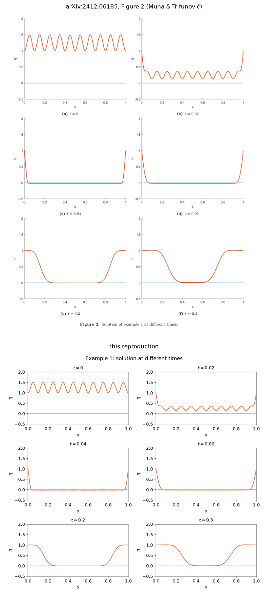
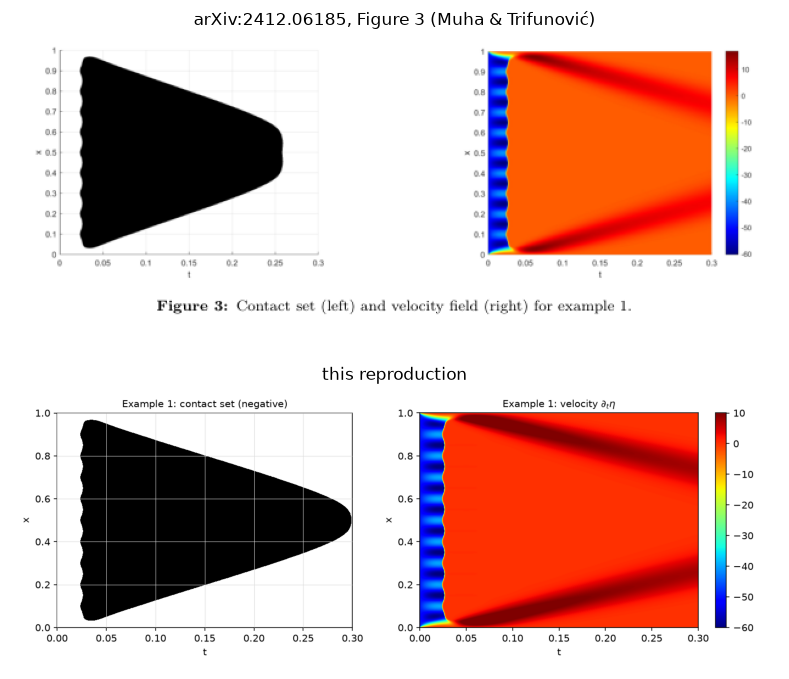
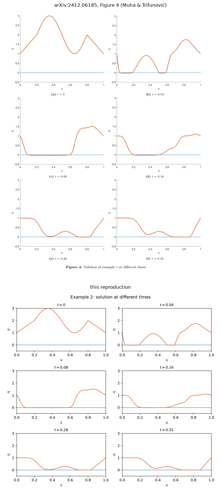
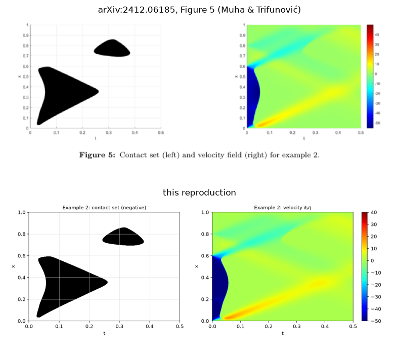
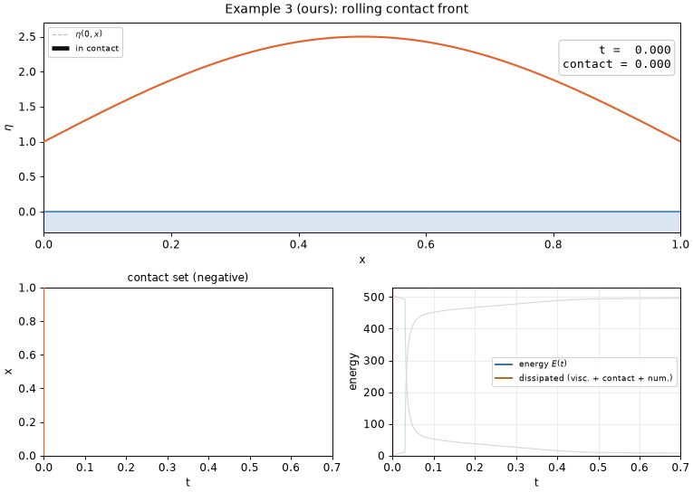

# contact-damped-wave

Reproduction of the numerical experiments (Section 6, Examples 1 and 2, Figures 2–5) of

> B. Muha, S. Trifunović, *Analysis of an Inelastic Contact Problem for the Damped
> Wave Equation*, arXiv:2412.06185 (v2, 2025-05-15)

in **Python + uv**, plus an original example (Example 3) and GIF animations built on
the validated solver.

The problem is the inelastic contact of a one-dimensional viscoelastic string
vibrating above a rigid obstacle at $y=0$:

$$
\partial_{tt}\eta-\alpha\,\partial_{txx}\eta-\partial_{xx}\eta
=\frac1\varepsilon\,\chi_{\{\eta<0\}}(\partial_t\eta)^-,\qquad \eta(t,0)=\eta(t,l)=h.
$$

We solve it with the same finite-difference scheme as the paper (second-order central
differences in space, implicit viscous/elastic terms, explicit penalty term), plot
solution snapshots, the contact set in the $(t,x)$ plane, and the velocity field, and
render GIF animations.

Implementation notes, the discrepancies found in the paper's description, and the full
reproduction record live in [docs/notes.md](docs/notes.md).

## Status

- [x] Solver (`params` / `initial_data` / `solver` / `diagnostics` / `plotting` / `animation` / `cli`)
- [x] Validation tests (55 tests: first-order convergence against an analytic solution,
      an independent residual check of the printed stencil, exact discrete energy
      identity, symmetry, grid/penalty convergence, CLI smoke tests)
- [x] Example 1 reproduction (Fig. 2, 3)
- [x] Example 2 reproduction (Fig. 4, 5)
- [x] Two rounds of external review (codex) addressed ([docs/notes.md](docs/notes.md) §5)
- [x] Original **Example 3** and GIF animations ([docs/notes.md](docs/notes.md) §6–7)
- [x] Side-by-side comparison images against the paper's figures (below,
      `scripts/make_comparison.py`)
- [ ] Remaining: numerical check that contact dissipation localizes at the contact
      boundary (Thm 2.3)

### Reproduction summary

| | Paper | This reproduction |
|---|---|---|
| **Ex. 1** first contact | ≈0.02 | 0.0236 |
| **Ex. 1** contact set | triangle symmetric about $x=0.5$, 10 ripples on the left edge | same shape and ripple count, matched visually (symmetry to $1.7\times10^{-12}$) |
| **Ex. 1** contact vanishing | ≈0.26 | 0.299 — **the only discrepancy** ([docs/notes.md](docs/notes.md) §3) |
| **Ex. 2** connected components | 2 | 2 ✓ |
| **Ex. 2** large component | $t\in[\sim0.02,\sim0.26]$, $x\in[\sim0.1,\sim0.6]$ | $t\in[0.026,0.261]$, $x\in[0.032,0.594]$ ✓ |
| **Ex. 2** small component | $t\in[\sim0.25,\sim0.37]$, $x\in[\sim0.65,\sim0.85]$ | $t\in[0.243,0.381]$, $x\in[0.693,0.860]$ ✓ |

All six snapshots match Fig. 2 / Fig. 4 in both examples — see the side-by-side
comparisons below and judge for yourself; note that Example 2 runs on initial data
*inferred from* Fig. 4(a) rather than the printed formula (see problem 1 below). The
discrete energy balance closes to machine precision (drift $\sim10^{-10}$). Runtime is
0.3–0.5 s per example at the paper's resolution.

**Two significant problems with the paper's description were confirmed**
(details in [docs/notes.md](docs/notes.md)):

1. Example 2's initial data, as printed, is discontinuous (a jump of 1.202 at $x=0.8$),
   **negative on $(0.5,0.8)$** — the sine branch dips to $-1$ at $x=0.65$, so 30% of the
   string would start below the obstacle — and has $\eta^0(0)=0$, violating the
   assumption of Theorem 2.1; $E(0)$ comes out 9 times too large and Fig. 4 cannot be
   reproduced from it. We default to a formula consistent with the figure (the literal
   formula is available via `--initial paper-literal`).
2. The explicit penalty term has an undocumented **monotonicity condition
   $\Delta t/\varepsilon<1$**: for $1\le\Delta t/\varepsilon<2$ the penalized velocity
   bounces instead of decaying monotonically and the contact set degrades badly, and for
   $\Delta t/\varepsilon\ge2$ the update grows and the run blows up. The paper's setting,
   $0.4$, is safely monotone.

### Side-by-side comparison with the paper's figures

Top rows: the corresponding figure excerpted from
[arXiv:2412.06185](https://arxiv.org/abs/2412.06185) (© B. Muha, S. Trifunović; reproduced
here for scholarly comparison). Bottom rows: this reproduction. Regenerate with
`uv run python scripts/make_comparison.py` (needs the paper's PDF, see Setup).

**Example 1, snapshots (Fig. 2)** — note panel (f): the paper's own $t=0.3$ snapshot still
shows a flat contact region, consistent with our vanishing time 0.299 rather than with
Fig. 3's $\approx0.26$ ([docs/notes.md](docs/notes.md) §3):



**Example 1, contact set and velocity field (Fig. 3)** — the same triangle with 10 ripples
on the left edge; the visible difference is the tip, $t\approx0.26$ vs. our $0.299$:



**Example 2, snapshots (Fig. 4)**:



**Example 2, contact set and velocity field (Fig. 5)** — two components with matching
shapes, positions and extents:



## Example 3 (original): a rolling contact front



In the paper's examples the fast-falling part of the string slaps down essentially at
once and the contact set consists of shrinking triangles — one in Example 1, where the
whole string falls uniformly, two in Example 2, where the right 40% falls a hundred
times slower. Using the validated solver we designed one example where contact happens
differently ([docs/notes.md](docs/notes.md) §6):

$$
\eta^0(x)=1+\tfrac32\sin(\pi x),\qquad
v^0(x)=-110\,\sin(\pi x)\cdot\tfrac12\Big(1-\tanh\tfrac{x-0.35}{0.1}\Big),\qquad T=0.7,
$$

with the paper's discretization parameters. Only the **left half** of the arched
string is given downward velocity, so the left side touches down first and sticks,
and the disturbance propagates rightward, laying the string down progressively. The
contact set becomes a **band crossing the $(t,x)$ plane diagonally**, with the front
moving right at speed 1.24–1.46.

The initial data is fully compatible with the clamped ends
($\eta^0(0)=\eta^0(1)=h$ and $v^0(0)=v^0(1)=0$), unlike the paper's two examples,
whose initial velocities are nonzero at the endpoints ($-50$ at both ends in
Example 1; $-50$ / $-0.5$ in Example 2) and create an initial layer there.

```bash
uv run cdw run     --example 3 --min-component-size 20   # results/ex3/*.png
uv run cdw animate --example 3 --frames 180 --fps 18 --dpi 85 --store-every 5
```

The paper's two examples can be animated the same way
(`results/ex{1,2}/animation.gif`). The GIF has three panels — the string (contact
portion highlighted in black), the contact set revealed up to the current time, and
the energy balance — and is written with Pillow only, no ffmpeg required.

## Setup

Requires [uv](https://docs.astral.sh/uv/); it provisions Python 3.12 automatically.

```bash
git clone <this-repo> && cd 2025_contact_damped_wave_repro
uv sync            # creates .venv with numpy / scipy / matplotlib and dev tools
uv run python -c "import contact_damped_wave, numpy, scipy, matplotlib; print('ok')"
```

The paper's PDF is not tracked in git. To fetch it:

```bash
mkdir -p paper && curl -L -o paper/2412.06185v2.pdf https://arxiv.org/pdf/2412.06185v2
```

## Usage

```bash
uv run python scripts/run_examples.py            # all 3 examples + literal-formula variant (~2 s)
uv run python scripts/run_examples.py --animate  # also render GIFs (~5 min)
uv run cdw run --example 1                       # Fig. 2, 3 equivalents in results/ex1
uv run cdw run --example 2                       # Fig. 4, 5 equivalents in results/ex2
uv run cdw run --example 3                       # original example in results/ex3
uv run cdw run --example 2 --initial paper-literal --out results/ex2_paper_literal
uv run cdw animate --example 3                   # results/ex3/animation.gif
uv run python scripts/convergence_study.py       # self-convergence: Δx = Δt jointly, ε sweep
uv run python scripts/make_comparison.py         # side-by-side images vs. the paper's figures
uv run pytest                                     # validation tests (55 tests, ~5 s)
uv run ruff check . && uv run ruff format .
```

There are two subcommands, `run` (figures and diagnostics) and `animate` (GIF); the
problem-selection and parameter-override options are shared.

Main options (`uv run cdw run --help` / `uv run cdw animate --help`):

| Option | Default | Meaning |
|---|---|---|
| `--example {1,2,3}` | required | 1 and 2 are the paper's examples, 3 is ours |
| `--dx --dt --eps --alpha --final-time --h` | paper values | parameter overrides |
| `--initial {figure,paper-literal}` | `figure` | Example 2 initial data ([docs/notes.md](docs/notes.md) §2 (b)) |
| `--initial-step {backward,forward}` | `backward` | how to start the three-level recursion (§2 (d)) |
| `--contact-mode {negative,threshold}` | `negative` | contact-set criterion (§2 (e)) |
| `--contact-tol` | $10^{-12}$ | tolerance used by `--contact-mode threshold` |
| `--connectivity {1,2}` | 2 | connected-component neighborhood (2 = 8-connected) |
| `--store-every` | run: 1 / animate: 5 | snapshot thinning |
| `--frames --fps --dpi` | 200 / 20 / 90 | `animate` only; `--dpi` controls file size |

Outputs (all under `--out`, default `results/exN`): `run` writes the figures
(`fig{2,4}_snapshots.png` etc.; plain `snapshots.png` etc. for Example 3),
`energy.png`, `summary.txt`, and an `.npz` whose name encodes the parameters;
`animate` writes `animation.gif`.

## Paper settings (shared)

| Parameter | Value |
|-----------|-------|
| $l$ | 1 |
| $\Delta t=\Delta x$ | $1/5000$ |
| $\alpha$ (viscoelasticity) | 0.01 |
| $\varepsilon$ (penalty) | 0.0005 |
| $h$ (endpoint height) | 1 (from the figures) |
| Example 1 | $T=0.3$, $\eta^0=1+\tfrac12\sin^2(10\pi x)$, $v^0=-50$ |
| Example 2 | $T=0.5$, piecewise initial data (below), $v^0=-50$ ($x<0.6$), $-0.5$ ($x\ge0.6$) |
| Example 3 (ours) | $T=0.7$, $\eta^0=1+\tfrac32\sin(\pi x)$, $v^0=-110\sin(\pi x)\cdot\tfrac12(1-\tanh\frac{x-0.35}{0.1})$ |

Example 2's default initial displacement (read off Fig. 4(a); the paper's printed
formula is inconsistent, see [docs/notes.md](docs/notes.md) §2 (b)):

$$
\eta^0(x)=\begin{cases}
1+5x, & 0\le x<0.2,\\
2+\sin\!\big(\pi(x-0.2)/0.3\big), & 0.2\le x<0.8,\\
6-5x, & 0.8\le x\le1.
\end{cases}
$$

## Layout

```
docs/notes.md               reproduction notes (scheme, discrepancies, results, Example 3)
src/contact_damped_wave/
  params.py                 Params dataclass and the EXAMPLE1 / EXAMPLE2 / EXAMPLE3 settings
  initial_data.py           initial data for the 3 examples (Ex. 2: figure / paper-literal)
  solver.py                 tridiagonal implicit solver with exact discrete energy balance
  diagnostics.py            contact set, connected components, penetration depth, energy balance
  plotting.py               Fig. 2–5 equivalents
  animation.py              GIF animations (Pillow only)
  cli.py                    the `cdw run` / `cdw animate` commands
tests/                      55 validation tests
scripts/                    run_examples.py / convergence_study.py / make_comparison.py
results/                    generated figures, summaries, paper comparisons (comparison/)
paper/                      paper PDF and page images (untracked)
```

## Reference

- B. Muha, S. Trifunović, *Analysis of an Inelastic Contact Problem for the Damped Wave Equation*,
  arXiv:2412.06185, <https://arxiv.org/abs/2412.06185>
